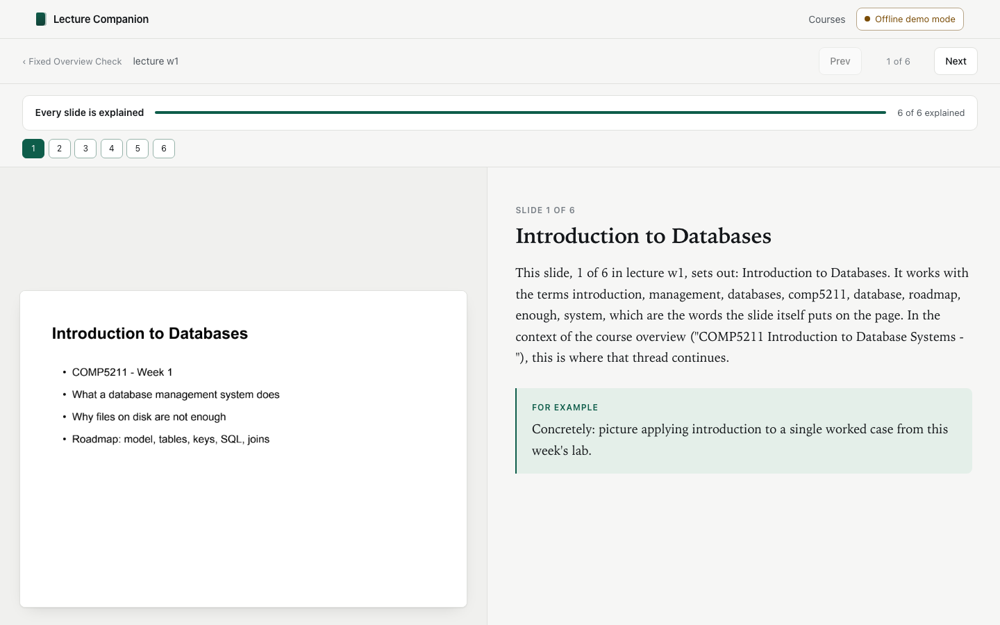

# Lecture Companion

Imports mixed course material into a structurally isolated evidence library and
turns lecture slides into a plain-language textbook you can read straight through.

You upload a course's slides, and for every slide you get the rendered page on
the left and, on the right, an explanation in ordinary language: what the slide
means, a concrete example where one fits, and a small diagram when the material
is worth drawing. Each explanation is written knowing the course overview and
what the earlier slides already covered, so the sequence reads as one continuous
text rather than a pile of disconnected answers.

Everything runs locally except requested explanation generation and connected selected-context questions.

<p align="center">
  
</p>

## Running it

```bash
./run.sh
```

First run creates `.venv` and installs dependencies; then it serves on
<http://127.0.0.1:8765>. Override with `LC_PORT`.

To try the whole thing with no API key and no spend:

```bash
LC_FAKE_MODEL=1 ./run.sh
```

That swaps in a stub model that produces a deterministic explanation for every
slide from the slide's own extracted text. It exercises import, extraction,
retrieval, the running summary, resume, and the viewer, including mermaid
diagrams. The explanations read mechanically, because the point is to verify the
machinery for free, not to write good prose.

Tests need no key and make no network calls:

```bash
.venv/bin/python -m pytest
```

## What it actually does

**Connect.** One field for a DeepSeek API key. The key is tested with a cheap
call before it is accepted, and then stored in the **OS keyring** — never in a
file, never in the repo, never in a log line, never in an HTTP response. The
header shows a masked hint (`sk-ab…9f2c`); reopen it any time to change the key.

**Import.** Create a course, then upload PDF, PPTX, DOCX, XLSX, CSV, or IPYNB
files. Every original is preserved byte for byte. Each file records its original
relative path, content hash, format, purpose, extraction quality, and version.
Unchanged files are not extracted twice. Identical bytes keep distinct hierarchy
references while sharing one stored original. A changed file supersedes its
earlier version without erasing the previous source version.

PDF and PowerPoint files are also filed automatically as either **slides** or a **reference document** (a
syllabus or programme breakdown) using local heuristics only — filename cues,
words-per-page density, and structural signals like "learning outcomes" or
"office hours". There is no review step, and the app tells you why it decided
what it did ("dense prose (322 words/page) and mentions learning outcomes and
grading"). Reference documents are distilled into a course overview that every
explanation is written against.

Word blocks and tables, workbook sheets and cells, CSV fields, and notebook
cells and outputs are extracted into typed learning objects. Each object has a
stable locator that resolves to its exact page, slide, speaker note, document
block, sheet and cell, chart, notebook cell and output, or dataset field. The
browser provides native read-only views for every format, including rendered
pages, ordered Word blocks, workbook sheets and cells, bounded dataset previews,
and notebook cells and outputs. Every source object has a copyable deep link.

If you have a pile of files and no course yet, drop them all in. The app groups
them into proposed courses by course code and filename prefix and shows you the
grouping before anything is written.

You can also choose a complete folder tree. Selecting a parent `Courses` folder
groups files by its immediate course folders and preserves paths such as
`L1/` and `L2/`. Re-selecting the same folder later skips files whose relative
path and bytes are unchanged, so they are not extracted or processed twice.

**Read.** The course list opens into a two-pane viewer: the rendered slide, and
the explanation with its heading, body, a set-off example, and a mermaid diagram
where one helps. Arrow keys move between slides. Light and dark themes.

**Ask selected context.** In any artifact viewer, select up to twelve source
objects and ask a question. The answer is restricted to those objects and cites
their exact deep links. The UI states what is sent remotely. Only the question
and bounded selected excerpts go to DeepSeek. Original files, unselected
objects, and other courses are excluded. Offline demo mode returns a local,
deterministic evidence-only answer.

**Run notebook code.** Notebook viewers disclose the exact local Python and
package versions, file scope, network denial, time, output, file, memory, and
process limits before execution. After explicit confirmation, run every code
cell or only selected cells. Computed stdout, tables, plots, warnings, errors,
and local traces stay separate from saved notebook output and link back to the
exact source cell. Stop and resume uses a durable namespace checkpoint, so
completed cells are not run twice. Source changes mark prior runs stale.

**Search and relationships.** Each course has a local typed-object search over
slides, notes, document blocks, formulas, code, outputs, and dataset fields.
Results open the exact source object. An inspectable alias catalog connects
nearby terms such as shrinkage and ridge without presenting the local lexical
index as a semantic model. The course graph shows measured concept-to-file
matches, explicit notebook-to-dataset references, and visibly labeled
prerequisite candidates. It rebuilds automatically when source versions change.

**Every course is sealed.** A course's slides, reference documents, overview,
retrieval indexes, concept graph and running summary all live in its own directory, and nothing
outside that directory is read while serving it. Explaining a slide in one
course cannot pull material or memory from another.

**Pause and resume.** Processing checkpoints after every single slide. If you
stop it, close the app, or hit a rate limit, it records where it got to and
resumes from the first unfinished slide — it never re-calls the model for a
slide that already has an explanation. A 429 from the API surfaces as a *paused*
state with a Resume button, not an error that loses your place. The running
summary is rebuilt purely from stored explanations, so a resumed course reads
the same as one that ran straight through.

## How a slide gets explained

1. **Extract** — the page is rendered to an image and its text pulled out.
2. **Assemble context** — the course overview, a running plain-language summary
   of everything covered so far, and the most relevant earlier explanations
   found by vector search. All three are scoped to this course alone.
3. **Generate** — the slide image and that context go to a vision model, which
   returns a heading, body, example, and optionally a mermaid diagram. The
   prompt tells it to describe only what the slide supports.
4. **Remember** — the explanation is stored, embedded, indexed, and folded into
   the running summary, so the next slide reasons from it.

## Models

| Job | Model | Where |
|---|---|---|
| Explanation | DeepSeek `deepseek-v4-flash-vision-exp` | remote, key required, paid |
| Retrieval embeddings, default | a deterministic hashing embedder (384-dim) | local, free, no download |
| Retrieval embeddings, opt-in | `intfloat/multilingual-e5-small` (384-dim) | local, free, ~470 MB |

**The default install uses the hashing embedder**, not e5, so nothing forces a
torch download and the tests run offline. It is a real bag-of-features
embedder — word unigrams and bigrams, signed hashing, sublinear term
frequency, L2-normalised — good enough that retrieval returns sensible
neighbours, but weaker than a trained model and not multilingual in any
meaningful sense. To use e5 instead:

```bash
.venv/bin/pip install -e ".[embed]"
```

Both produce 384 dimensions, so an index built with one is the wrong shape for
the other in spirit even though it loads; rebuild a course's index after
switching.

## File handling

| Input | Rendering | Text |
|---|---|---|
| PDF | `pypdfium2` | `pypdf` |
| `.pptx` | headless LibreOffice → PDF | `python-pptx`, including speaker notes |
| `.docx` | original download | `python-docx`, including ordered blocks, tables, images, and links |
| `.xlsx` | original download | `openpyxl`, including formulas, cached values, sheets, charts, tables, filters, hidden state, formatting metadata, merged cells, and validation |
| `.csv` | dataset profile | local streaming profile of schema, types, missingness, counts, and bounded samples |
| `.ipynb` | notebook structure | local JSON extraction of Markdown, code, outputs, errors, execution counts, rich output data, and kernel metadata |

Without LibreOffice installed, `.pptx` still imports: slides are painted from
their text and marked `[no renderer: text-only extraction]` so you can tell.

## Where your data lives

Everything is under `Courses/<course-id>/` in this directory — slides,
extracted text, explanations, the search indexes, concept relationships, and the progress checkpoint.
It is gitignored and never leaves your machine by default. A slide image with
its bounded context goes to DeepSeek when you request an explanation. A question
and the bounded source objects you explicitly selected go to DeepSeek when you
ask selected context. Original files, unselected objects, and other courses are
not sent by the question workflow.

## Status, honestly

Verified against the **live DeepSeek API**, not only the stub:

- A 6-slide deck was explained end to end by `deepseek-v4-flash-vision-exp`.
  Spot-checking three explanations against the slides' own extracted text found
  no invented claims, and the back-references were correct — the explanation of
  the "Keys and Constraints" slide cites "a relation is a set of tuples" and
  "NULL means unknown, not zero", both of which really are on the two earlier
  slides it names.
- The title slide was correctly read as an agenda rather than padded out:
  *"It does not teach any content yet; it sets out what will be covered."*
- **Resume was proven against the live API by accident**, which is the best
  kind of proof. The server was killed with five of six slides done; on
  restart it generated exactly one more. The timestamps in the stored
  explanations show slides 1-5 within the first 106 seconds and slide 6 at
  347 seconds, across the restart. Nothing was paid for twice.

Also verified with the stub, free and offline: import, filing, extraction,
retrieval, per-course isolation, checkpointing, pause on a 429, and the viewer
in both themes. `pytest` is green, and `scripts/gate_g2.py` drives a real
headless browser to prove the viewer does not overflow at 1440px.

The six-format corpus gate imports all 29 current course files without writing
to the source folders, checks every preserved original by SHA-256, and verifies
that every artifact has typed objects with matching source locators:

```bash
.venv/bin/python scripts/verify_real_corpus.py
```

With a fake-model server running against a project-internal course root, this
gate measures all five courses, exact search links, concept relationships,
course isolation, warm-search latency, and the browser UI at both target sizes:

```bash
.venv/bin/python scripts/gate_course_knowledge.py --base http://127.0.0.1:45711 --courses-root .internal/knowledge-courses
```

This gate executes a released Business Data Analytics notebook cell against
its relative `Airbnb.csv` path, forces and resumes an interruption, checks
computed provenance, and operates all-cell and selected-cell controls at both
target viewport sizes:

```bash
LC_COURSES_ROOT=.internal/notebook-courses LC_FAKE_MODEL=1 LC_PORT=45729 ./run.sh
.venv/bin/python scripts/gate_notebook_execution.py --base http://127.0.0.1:45729 --courses-root .internal/notebook-courses
```

Known limits:

- The retrieval quality claim rests on the hashing embedder. The e5 path is
  implemented but has not been measured.
- `.pptx` rendering has been exercised on a small deck; complex decks with
  animations, embedded video or unusual fonts are untested.
- DOCX, XLSX, and CSV have native read-only viewers, cited selected-context
  questions, and cross-artifact local search. They do not yet have
  artifact-specific generated explanations or resumable model processing.
- IPYNB adds confirmed, locally sandboxed, interruption-safe execution on this
  macOS prototype. It does not install arbitrary notebook dependencies or
  enable network access.
- Prerequisite arrows are transparent catalog candidates. They are not promoted
  to source facts unless linked course evidence states the dependency.
- The offline stub writes deliberately mechanical prose. It exists to verify
  the machinery for free, not to demonstrate explanation quality — judge that
  with a real key.
